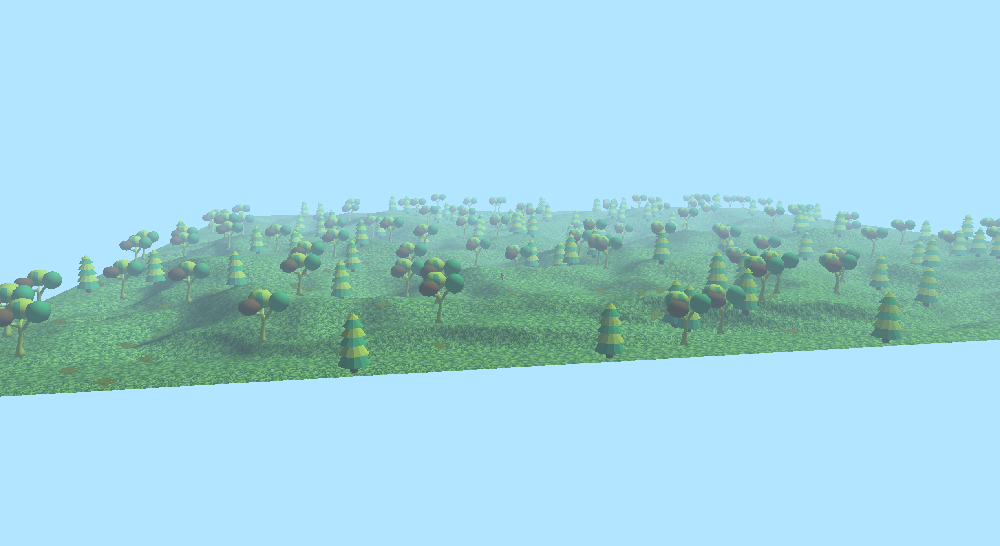
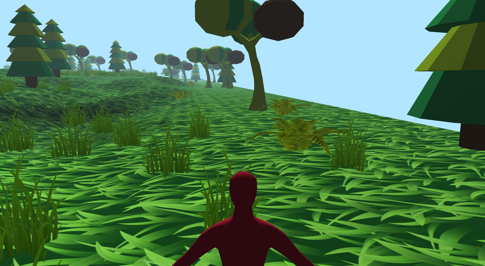

# README
#### Author : Louis PERON 
# javaGameEngine
*3D game environment coded in Java with the assistance of LWJGL (Lightweight Java Game Library)*

## Goal
My goal with this project was to explore the world of video game programming and enhance my understanding of software architecture.
## Preview

Some images of the three-dimensional engine :

1. Map
   
2. Character
   
3. First person possible
   
4. Light effects on a dragon model
   

## How to install the project

To make this project work on your preferred IDE, you will need to pull the project and import the Jars properly (in the build path for Eclipse, or in Project Structure -> Libraries for IntelliJ).

*Under IntelliJ, you will need to import both the Jars and the Natives.*

The Jars and Natives can be found in the directory: lib/jars and lib/natives.

Finally, by navigating to src/engineTester/MainGameLoop => you can run the project!

## Structure

To create 3D models, we use .obj files from Blender in this engine. By decoding these files, we obtain all the vertices and points in the object's space.

In this engine, I have implemented fog to obscure the edges of the map, as well as lights and shadows, and the movement of a character within the environment.

One could envision implementing procedural map generation, adding animations to character movements, incorporating multiplayer features, and so on in the future.

The possibilities are endless !

Now it's your turn to take the lead.